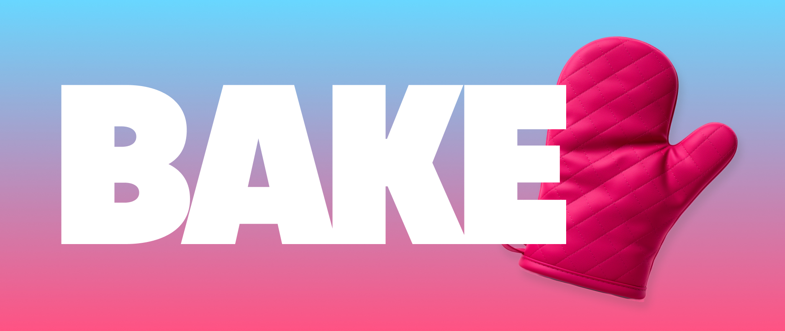

# BAKE AI



A personalized, project-aware AI assistant for the terminal — for research and
personal projects, not coding. **No provider lock-in, no subscription, no living
inside the ChatGPT/Gemini apps.**

`bake` is a thin, provider-agnostic wrapper around [goose](https://goose-docs.ai/)
that gives each of your projects its own prompt, docs, and context — so you never
start a new chat from zero.

## How it works

- **The tool is public; your data is private.** `bake` (this repo) holds only code
  and templates. Your projects live in a separate **workspace** (default `~/bake`),
  which you can make your own private git repo.
- **A project = a folder = a goose recipe**, with its own `.goosehints` (always-loaded
  context), `docs/` (curated reference), and `vault/` (notes).
- **Secrets stay in goose.** The OpenRouter API key lives in your OS keyring via
  goose — `bake` never reads, stores, or logs it.

## Project files

Each project is a folder with these pieces:

```
coffee/
  recipe.yaml     # how the assistant is wired (model, role, tools)
  .goosehints     # always-loaded context
  docs/           # curated reference, read on demand
  skills/         # reusable task playbooks, read on demand
  vault/          # accumulated notes & decisions (INDEX.md)
```

The key split: **`recipe.yaml` + `.goosehints` are loaded on every message**, while
**`docs/`, `skills/`, and `vault/` are read on demand** — the assistant opens them
only when relevant, so they don't cost tokens every turn.

- **`recipe.yaml`** — the goose recipe: the model/provider, the assistant's role
  (its `instructions`), and which tools are enabled. This is _how the agent is
  wired_, not what it knows. Edit it to change the model, the persona, or tools.
- **`.goosehints`** — durable, high-value facts the assistant should **always** know:
  who you are, the project's core facts, your tone, and pointers to the rest. Loaded
  in full every message, so keep it tight.
- **`docs/`** — larger or occasional **reference** material (product lists, pricing,
  specs, pasted notes/PDFs). Too big or too situational to always load; the assistant
  reads what it needs.
- **`skills/`** — **how-to** playbooks for recurring tasks (e.g. "write tasting
  notes", "draft marketing copy") — method and format you want applied consistently.
- **`vault/`** — the project's **memory over time**: decisions and topic notes, with
  an `INDEX.md`. Hand-maintained today; auto-updated after each chat in the roadmap.

### Which one do I use?

| You want to…                                   | Put it in…    |
| ---------------------------------------------- | ------------- |
| Change the model, persona, or enabled tools    | `recipe.yaml` |
| State a fact the assistant must _always_ know  | `.goosehints` |
| Add big or situational reference material      | `docs/`       |
| Define how a repeatable task should be done    | `skills/`     |
| Record a decision or outcome to build on later | `vault/`      |

Rule of thumb: **always-known and short → `.goosehints`; everything larger goes in
`docs/`/`skills/`/`vault/` and is pulled in only when needed.**

## Install

Requires [Go](https://go.dev/) and [goose](https://formulae.brew.sh/formula/block-goose-cli):

```sh
brew install block-goose-cli
goose configure          # Configure Providers → OpenRouter → paste key
go install github.com/alexpagnotta/bake-ai/cmd/bake@latest
```

Make sure `$(go env GOPATH)/bin` is on your `PATH`.

## Usage

```sh
bake init                # set up workspace + non-secret config
bake new coffee          # scaffold a project
# edit ~/bake/projects/coffee/.goosehints to give it context
bake chat coffee         # start a session that already knows your project
bake list                # list projects
```

## Status

MVP: project scaffolding + per-project context + chat (Phase 1) and a Charm TUI
(Phase 2). See `plans/initial.md`. Post-MVP plans live in `ROADMAP.md`.

## License

MIT
